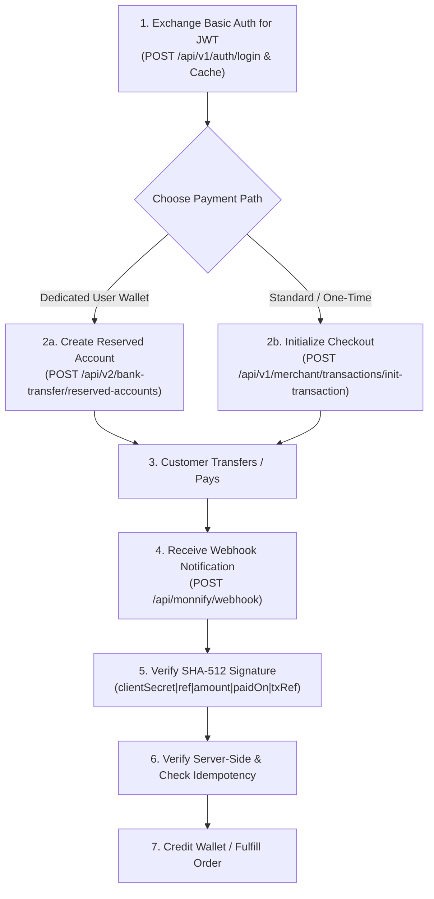

# Monnify Payments & API Integration Skill

This skill guides you through integrating Monnify into web and mobile backends. It covers OAuth 2.0 token caching, Dedicated/Reserved Virtual Accounts for customer wallets, ephemeral dynamic checkout accounts, SHA-512 webhook verification, bank disbursements/payouts, and sub-account split payments.

---

## Core Monnify Rules & Directives

1. **Standard Currency Units (Not Subunits)**:
   - Unlike Paystack, Monnify uses **standard currency amounts** (e.g. `₦1,500.00` is sent as `1500.00` or `1500`, **not** `150000` kobo).
2. **Mandatory OAuth 2.0 Token Caching**:
   - The `/api/v1/auth/login` endpoint returns an `accessToken` with a 3600-second (1 hour) lifespan.
   - **Never call the login endpoint per transaction.** Cache tokens in-memory or in Redis and refresh 60 seconds prior to expiration.
3. **Never Fulfill on Client Callbacks**:
   - Always verify payment status via **Server-to-Server Query** (`GET /api/v2/transactions/{reference}`) or **Webhook Notifications** (`SUCCESSFUL_TRANSACTION`).
4. **Mandatory SHA-512 Webhook Signature Verification**:
   - Compute $\text{SHA512}(\text{clientSecret} + \text{"|"} + \text{paymentReference} + \text{"|"} + \text{amountPaid} + \text{"|"} + \text{paidOn} + \text{"|"} + \text{transactionReference})$.
   - Verify against the incoming `monnify-signature` header or `transactionHash` using constant-time comparison (`crypto.timingSafeEqual`).
5. **Always Enforce Idempotency**:
   - Store incoming `transactionReference` values to prevent duplicate crediting from retried webhooks or double-submissions.

---

## Standard Integration Workflows

### Workflow 1: OAuth 2.0 Token Caching
1. Generate Basic auth string: `base64(apiKey:secretKey)`.
2. Request access token: `POST /api/v1/auth/login`.
3. Store the token with an expiry timestamp (`now + (expiresIn - 60) * 1000`).
4. Attach `Authorization: Bearer <accessToken>` to all outgoing API requests.
> See [oauth_and_token_caching.md](./references/oauth_and_token_caching.md) for complete Node.js/TypeScript and Python clients.

### Workflow 2: Dedicated Reserved Virtual Accounts (Wallets)
1. Call `POST /api/v2/bank-transfer/reserved-accounts` with `accountReference`, `customerName`, `customerEmail`, `bvn`, and `getAllAvailableBanks: true`.
2. Save the returned bank account numbers (e.g. Wema Bank, Sterling Bank) against your user's wallet record.
3. User transfers funds from their banking app anytime.
4. Listen for `SUCCESSFUL_TRANSACTION` webhook to credit the user's wallet automatically.
> See [payment_and_reserved_accounts.md](./references/payment_and_reserved_accounts.md).

### Workflow 3: Standard Checkout & Dynamic Accounts
1. **Initialize Transaction**: Call `POST /api/v1/merchant/transactions/init-transaction` with `amount`, `paymentReference`, `customerName`, `customerEmail`, and `contractCode`.
2. **Display Checkout**: Redirect customer to `responseBody.checkoutUrl` or trigger `MonnifySDK.initialize(...)` on the web frontend.
3. **Verify Server-Side**: On completion, call `GET /api/v2/merchant/transactions/query?paymentReference={ref}` and check `paymentStatus === "PAID"` and `amountPaid >= expectedAmount`.
> See [payment_and_reserved_accounts.md](./references/payment_and_reserved_accounts.md).

### Workflow 4: Webhook Handling & Security
1. Receive incoming `POST` request from Monnify.
2. Calculate expected SHA-512 hash:
   $$\text{SHA512}(\text{clientSecret} + \text{"|"} + \text{paymentReference} + \text{"|"} + \text{amountPaid} + \text{"|"} + \text{paidOn} + \text{"|"} + \text{transactionReference})$$
3. Perform timing-safe comparison with `monnify-signature` header or `payload.transactionHash`.
4. Return HTTP `200 OK` immediately.
5. Process order fulfillment or account crediting asynchronously.
> See [webhook_handling.md](./references/webhook_handling.md) for Express, Next.js, and FastAPI implementations.

### Workflow 5: Bank Disbursements & Payouts
1. **Validate Destination Account**: Call `GET /api/v1/disbursements/account/validate?accountNumber=...&bankCode=...` to confirm account name.
2. **Initiate Transfer**: Call `POST /api/v2/disbursements/single` with `amount`, `reference`, `destinationBankCode`, `destinationAccountNumber`, and `sourceAccountNumber`.
3. **Query Status**: Check transfer status via `GET /api/v2/disbursements/single/summary?reference={reference}`.
> See [disbursements_and_payouts.md](./references/disbursements_and_payouts.md).

---

## Reference Guides Index

| Topic | Reference Document |
| :--- | :--- |
| **All API Endpoints** | [api_reference.md](./references/api_reference.md) |
| **OAuth 2.0 & Token Caching** | [oauth_and_token_caching.md](./references/oauth_and_token_caching.md) |
| **Payment Flows & Reserved Accounts** | [payment_and_reserved_accounts.md](./references/payment_and_reserved_accounts.md) |
| **Webhook Security & SHA-512** | [webhook_handling.md](./references/webhook_handling.md) |
| **Disbursements & Payouts** | [disbursements_and_payouts.md](./references/disbursements_and_payouts.md) |

---

## Integration Checklist

Before releasing your Monnify integration to production, verify:

- [ ] **Secret Key Protection**: `apiKey` and `secretKey` reside exclusively in environment variables on your server.
- [ ] **Standard Currency Units**: Amounts are sent in whole/decimal units (e.g. `1500.00`), NOT multiplied by 100.
- [ ] **Token Caching**: Access tokens are cached and renewed before expiry, rather than re-authenticating on each request.
- [ ] **Idempotent References**: Every transaction initialization, reserved account, and disbursement uses a unique reference.
- [ ] **SHA-512 Webhook Verification**: Webhooks compute and verify the SHA-512 signature using constant-time string comparison.
- [ ] **Double-Verification**: Backend confirms `paymentStatus === "PAID"` AND `amountPaid >= expectedAmount`.
- [ ] **Webhook 200 Acknowledgment**: Webhook endpoints respond with HTTP `200 OK` promptly to avoid retry floods.

